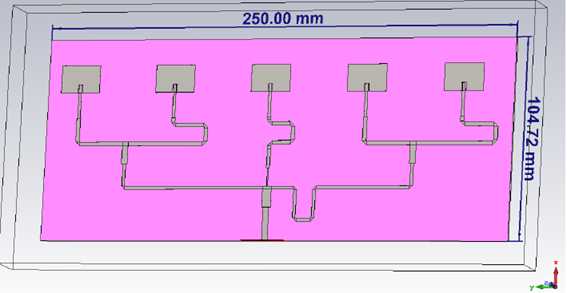

# Equi-Spaced Microstrip Patch Line Array Design at 5 GHz

Creating an equi-spaced microstrip patch line array with specific design parameters like frequency, beamwidth, counterpole radiation level, and directivity requires careful planning and simulation using electromagnetic simulation software such as  CST Microwave Studio. Here's a general outline of the steps you would follow for such a design:

## Table of Contents

- [Introduction](#introduction)
- [Steps](#steps)
- [License](#license)

## Introduction

This project aims to design an equi-spaced microstrip patch line array operating at a center frequency of 5 GHz. The design specifications include achieving an H-plane beamwidth between 50° and 95°, a counterpole radiation level below -20 dB, and a directivity (D0) exceeding 5 dBi. The antenna will be fabricated using fiberglass and microstrip technology, followed by measurements in an anechoic chamber.

Creating an equi-spaced microstrip patch line array with specific design parameters like frequency, beamwidth, counterpole radiation level, and directivity requires careful planning and simulation using electromagnetic simulation software such as HFSS (High-Frequency Structure Simulator) or CST Microwave Studio. Here's a general outline of the steps you would follow for such a design:

## Equi-Spaced Microstrip Patch Line Array Design at 5 GHz

### Introduction
This project aims to design an equi-spaced microstrip patch line array operating at a center frequency of 5 GHz. The design specifications include achieving an H-plane beamwidth between 50° and 95°, a counterpole radiation level below -20 dB, and a directivity (D0) exceeding 5 dBi. The antenna will be fabricated using fiberglass and microstrip technology, followed by measurements in an anechoic chamber.

### Steps:

1. **Antenna Design Parameters**:
   - Determine the desired array geometry, such as the number of patches, their dimensions, and spacing. The equi-spacing should be carefully chosen to meet the beamwidth requirements.
   - Calculate the dimensions of each microstrip patch element to resonate at 5 GHz.

2. **Radiation Pattern Simulation**:
   - Use electromagnetic simulation software (e.g., HFSS or CST) to simulate the radiation pattern of a single microstrip patch antenna.
   - Optimize the patch dimensions and feeding technique to achieve the desired beamwidth and directivity.

3. **Array Design**:
   - Design the equi-spaced array layout, ensuring that the inter-element spacing is uniform and optimized for the desired beamwidth.

4. **Feed Network**:
   - Design a feeding network for the array, considering the spacing between elements and the desired array factor.

5. **Radiation Pattern of the Array**:
   - Simulate the radiation pattern of the entire array using the designed feed network. Adjust the spacing and phase of individual elements to achieve the desired H-plane beamwidth.

6. **Counterpole Radiation**:
   - Analyze the radiation pattern to ensure that the counterpole radiation level is below -20 dB. Adjust element spacing and excitation phases as needed.

7. **Directivity Enhancement**:
   - Optimize the array design to achieve a directivity (D0) greater than 5 dBi. This may involve further adjustments to the element dimensions and spacing.

8. **Fabrication**:
   - Fabricate the designed microstrip patch array on a fiberglass substrate with the calculated dimensions and layout.

9. **Measurement in Anechoic Chamber**:
   - Conduct measurements in an anechoic chamber to validate the antenna's performance against the design specifications.

10. **Documentation**:
    - Document the design process, including dimensions, simulation results, and measurement data, in a detailed report.

If you want a more detailed explanation of the entire project, you can find it in the "memoria.pdf" document.

Please note that the actual design and simulation process may involve complex calculations and adjustments, and the choice of simulation software may vary. Additionally, it's essential to consider manufacturing tolerances and practical constraints during the fabrication process.

## License

This project is licensed under the [MIT License](LICENSE).

